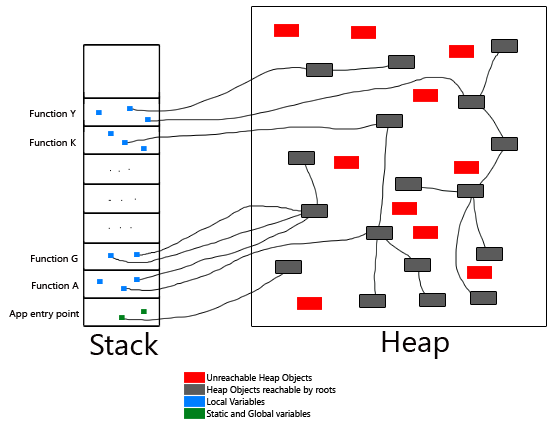

# Lesson 2


# Big Numbers

Write a function which computes the integral power: $n^k$
```java
	public static int ipow(final int n, final int k){
		if(k==0)
			return 1;
		int ans =n;
		for(int i=1; i<k ; i++){
			ans*=n;
		}
		return ans;
	}
```
Unfortunately this function stop working quite soon:

```java
	public static void main(String[] args) {
		int n=2;
		for(int i=0;i<100 ; i++)
			System.out.println(n+"^"+i + "\t"+ ipow(n, i));
	}
```
```
2^0		1
2^1		2
2^2		4
2^3		8
2^4		16
2^5		32
2^6		64
2^7		128
2^8		256
2^9		512
2^10	1024
2^11	2048
2^12	4096
2^13	8192
2^14	16384
2^15	32768
2^16	65536
2^17	131072
2^18	262144
2^19	524288
2^20	1048576
2^21	2097152
2^22	4194304
2^23	8388608
2^24	16777216
2^25	33554432
2^26	67108864
2^27	134217728
2^28	268435456
2^29	536870912
2^30	1073741824
2^31	-2147483648
2^32	0
2^33	0
2^34	0
2^35	0
2^36	0
2^37	0
2^38	0
2^39	0
...
```
Yes you say the problem is that `int` cannot hold large number as $2^{31}$. 
Let's write a new version which does not (in our dreams)  **overflow**:

```java
public static long ipow(final long n, final long k){
		if(k==0)
			return 1;
		long ans =n;
		for(int i=1; i<k ; i++){
			ans*=n;
		}
		return ans;
	}
```

```
2^0		1
2^1		2
2^2		4	
2^3		8
2^4		16
2^5		32
2^6		64
2^7		128
2^8		256
2^9		512
2^10	1024
2^11	2048
2^12	4096
2^13	8192
2^14	16384
2^15	32768
2^16	65536
2^17	131072
2^18	262144
2^19	524288
2^20	1048576
2^21	2097152
2^22	4194304
2^23	8388608
2^24	16777216
2^25	33554432
2^26	67108864
2^27	134217728
2^28	268435456
2^29	536870912
2^30	1073741824
2^31	2147483648
2^32	4294967296
2^33	8589934592
2^34	17179869184
2^35	34359738368
2^36	68719476736
2^37	137438953472
2^38	274877906944
2^39	549755813888
2^40	1099511627776
2^41	2199023255552
2^42	4398046511104
2^43	8796093022208
2^44	17592186044416
2^45	35184372088832
2^46	70368744177664
2^47	140737488355328
2^48	281474976710656
2^49	562949953421312
2^50	1125899906842624
2^51	2251799813685248
2^52	4503599627370496
2^53	9007199254740992
2^54	18014398509481984
2^55	36028797018963968
2^56	72057594037927936
2^57	144115188075855872
2^58	288230376151711744
2^59	576460752303423488
2^60	1152921504606846976
2^61	2305843009213693952
2^62	4611686018427387904
2^63	-9223372036854775808
2^64	0
2^65	0
2^66	0
2^67	0
2^68	0
```
We extended the range of our function up to $2^{62}$ but it's still failing. 
We need an integral type with **infinite precision**. `BigInteger` provided by `Java.Utils` solves the problem.

```java
	public static BigInteger ipow(final long n, final long k){
		if(k==0)
			return BigInteger.ONE;
		BigInteger bin = BigInteger.valueOf(n);
		BigInteger bians = bin;
		for(int i=1; i<k ; i++){
			bians=bians.multiply(bin);
		}
		return bians;
	}
```

This version works! even for very large numbers like $2^{20000}$.
```
2^20000	39802768403379665923543072061912024537047727804924259387134268656523863597493005704267600974997559551083646113750491270283140037693531914362175347041582702598121528242689349822482661597770759553946696101958869972677227973194131519818278726403485282120016456612793039071039818297993532771801687378482134951640611498291669186736187537002454587214079382727748256282419243923780158869781416852033865009090969753596652503275704943028645948297735737359802045058992731836566307671913693413259312676190669600377038530528457033111969100152658434772201238638188177942554921085169645825394357855769907215463965563079388394196137897184684111380418873025890383910366962608697446815065571048084159246565521180525786300781167688883955501753673175811344865675251415860144405164515466551438843161904239610671675576233872818346136985464892397290442755615882182377872919311145344584421697909543504577814457137895465212239606161514764254025074585722889399987549162501494601383934089132606093390103624999923863782757777466664480973403386161942036393646517873091923367311424456391505843899662583411213296799849557624932046287174777701216554388715625585835878485233506057488187655202568570482376807871081895186074137942924211085564497397742041381037351458450400689639267585499786687081856420723908387432495387127637571610150657515320574736396374074986751468261975677553450700687148588781240292773822757663528417424698854078597524002048126685307612717222802433056155012018200877759823054203370246340831667112088616926093400680579986459863631117978777673860899234606306309965964827966387817407478717923716975295704640458452530138415335834405590821969585485218521073976146055159665821101315991540956614542680973755041757822846583583089029449753546311208153767266405689162434577931152456001998431545614212628289848672834500476787349975268347140958736745059330239230790800459064475401253711332049360168213370931822264748908053164401532139115738717823215412682800776031371687224220961420096752218047571619997368946771401040467396145414646604585523221719668766514314761219915192127743230970046032143038153338524587743133053347947615233936450343632291966563104232874046361256584256041194702017400650789339627610383443623314091502539101438611920117646265955638834305860032671061890368374651657702121427693328917902105995692594971795604085797916591417097005621286993359358926862615199667659437080088509304823068715280321325473559474179907603945305727231988432234188324103638261759840188943913030187697549868173617421571128705344701371159600457480356270138824682251039152241906132066374092132175434416674489958816064929182353598338602590494204072458101761596842957701580

....
```
Imagine now you want to compute number much larger than $2^{20000}$. You soon realize that this takes quite a while using this approach. 
Infact the following code runs quite slowly (~`6s` on my Intel `i5`)

```java
public static void main(String[] args) {
		int n=2;
		long s = System.currentTimeMillis();
		for(int i=0;i<500000 ; i++)
			if(i==400000)
				System.out.println(n+"^"+i + "\t"+ ipow(n, i));
		long e = System.currentTimeMillis();

		System.out.println((double)(e-s)/1000.0);
	}
```

That is due to the fact that we are not using the best algorithm available for computing integer power:

```java
	public static BigInteger ipow(final int n, final int k){
		if(k==0)
			return BigInteger.ONE;
		if(k==1)
			return BigInteger.valueOf(n);
		if((k&1)==1)
			return ipow(n,k-1).multiply(BigInteger.valueOf(n));

		BigInteger res = ipow(n,k/2); 
		return (res).multiply(res);
		//return ipow(n,k/2).multiply(ipow(n,k/2));

	}

ipow(2,22) 
	ipow(2,11)									-> return ipow(2,10) *n
	  ipow(2,10)								-> return ipow(2,5) * ipow(2,5)
	  	  ipow(2,5)						-> return ipow(2,4) * n
 		  	  ipow(2,4)				-> return ipow(2,2)+ipow(2*2)
	   		  	  ipow(2,2)		-> return n*n  
	   		  	  	ipow(2,1)-> return n;

	   		  	  	  
time ->--------------------------------------------------------------	   		  	  	  

```
The same main now runs in `~0.18s`. A speedup of `~33x`!


#Garbage Collection and Immutable Strings
Java String does not provide any methods for modifying a string! That makes Strings `immutable`.

This is what happen you do 
```java
String s = "hello";
s = s.substring(0,3) + " blabla";
```
```c++
char* temp = malloc(9);
strncpy(temp, greeting, 3);
strncpy(temp + 3, "blabla", 6);
greeting = temp;
```

What happens if a String is assigned to another string like in the following?
```java
String s = "hello";
...

s = "bye bye old string";
```

This is the perfect receipt for a memory leak. `s` was allocated on the heap and is now thrown away. 
Java takes care of memory leaks like this using a **garbage collector**!

Java does not provide an deallocation mechanism because the garbage collector keeps track of all the object that cannot can be still referenced. Those who are not referenceable are deallocated by the JVM.

It has three main tasks:
1. Garbage detection i.e. understand when an object is now garbage.
2. Deallocate the heap referenced by the detected garbage
3. Minimize Heap Fragmentation (more in a operating system course)

**GC** marks all the objects  that are reachable starting from the root object and at the end of this operationg it can free the memory of those object which are not marked.


Pink and blue boxes are colliding while green and blue are not for instance. 

What you have to know at this point about fragmentation is that when a a large number of allocation and deallocation take place in the heap it is not hard to have a situation where an object cannot be allocated because the heap is lacking of subsequent space even if the overall free space in the heap is much larger than the amount required to allocate the new object.


At this point you should have covered everything about syntax and have seen concepts like
-  `Exceptions`
-  `Collection`


## Hello Classes
A class is a descrition both the **state** and the **behaviour** of an Object.
Think about the state of a traffic light. At any point what are the possible state a traffic light can be?

Do computer programs have a state? If yes what are the *variables* of a computer program state?

### Bookstore
What are getters and setters? 
Show how to automatically generate them using *eclipse*

- *Source -> Generate Getters and Setters*

```java
import java.util.Date;

/**
* A object representing a simplified version of a book.
* A book has a Date of publishing, an author, a number of pages expressed as an integer and 
* a String representing the International Standard Book Number.
* 
* @author Davide Spataro
*/
public class Book {
	
	private String author;
	private Date year;
	private int npages;
	private String ISBN;
	/**
	 * @return the author
	 */
	public String getAuthor() {
		return author;
	}
	/**
	 * @param author the author to set
	 */
	public void setAuthor(String author) {
		this.author = author;
	}
	/**
	 * @return the year
	 */
	public Date getYear() {
		return year;
	}
	/**
	 * @param year the year to set
	 */
	public void setYear(Date year) {
		this.year = year;
	}
	/**
	 * @return the npages
	 */
	public int getNpages() {
		return npages;
	}
	/**
	 * @param npages the npages to set
	 */
	public void setNpages(int npages) {
		this.npages = npages;
	}
	/**
	 * @return the iSBN
	 */
	public String getISBN() {
		return ISBN;
	}
	/**
	 * @param iSBN the iSBN to set
	 */
	public void setISBN(String iSBN) {
		ISBN = iSBN;
	}
	

}

```
```java
package BookStore;

/
public class BookStore {

	private Book[] library;
	

	/**
		Number of book inserted
	*/
	private int size;
	/**
		 Maximum capacity of the bookstore
	*/
	private int capacity;

	public BookStore(int _capacity) {
		capacity = _capacity;
		assert(capacity>0);

		library= new Book[capacity];
		size=0;
	}

	public void addBook(Book b){
		library[size] = b;
		size++;

		//short version
		//library[size++] = b;
	}

	public void removeBook(Book b){
        
	}

	public void removeBook(int b){

	}

	public void searchForBook(Book b){

	}
}
```

Make sure you get how to comment the code in the proper way. Check out the  Chapter 4 of the `Java Core I ` book.


**How to implement the remove method?**

**What about the search method?**
