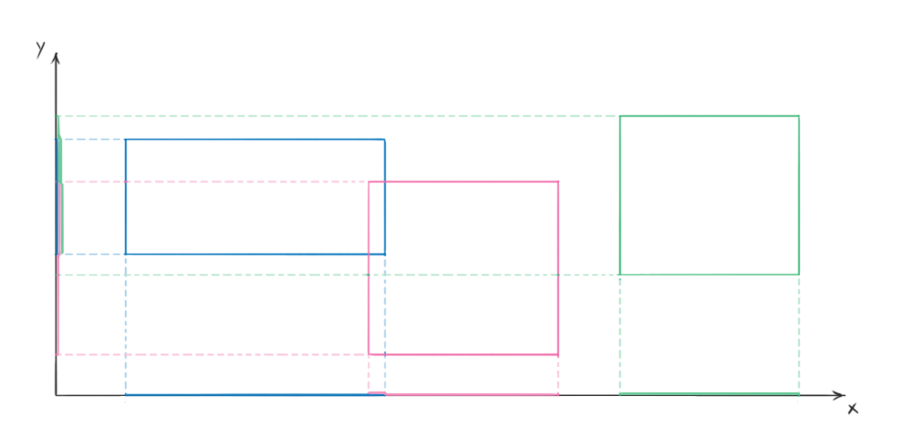

#Assignment - Implementing a simple Collision System


Given the following interface which exposes a method `collide` which takes a non modifiable **Collidable** as parameter returns true if `caller` collides with the given `Collidable` parameter.

```java

public interface ICollidable {
	
	public boolean collide(ICollidable c);

}

```

Create a class **Box** which implements `ICollidable` and stores fiels describing a  2D box in space.
 
***
 Two boxes collides if they share some portion on the space. 
* This is a blurry definition, you have to come up with a more formal and mathematical description of what collision means.*

`Box` must also override the `toString` method from `Object` superclass.

The following image gives you a (big) hint on how to formalize collisions in two 2D. 

Pink and blue boxes are colliding while green and blue are not for instance. 


Create a class Arena which stores information about a set of Collidable Objects and exposes a method with the following signatures. 
`Arena` also stores an array of `Collidable` which size (can be assumed) never exceed `1000`;

```java

	public void checkCollisions(){
	
	}
	
	@Override
	public String toString() {
	
	}
```

`checkCollisions` should check for all collision between all `ICollidable` objects. On the event of a collision between two objects **A and B** it should print the following:


```java
	System.out.println("Collision: " +  A.toString() + " "+ B.toString());
```


`toString` takes care of drawing the Arena to standard output (console). Draw the boundaries of the Area using the plus `+`, character.
Boxes must be drawn using the point `.` character and corner using the `+` character.
You can always assume that Collidable Objects coordinates are never lower than `0` or greater than `99`.


In order to test out collision detection system you should also provide a init function which init boxes randomly (within arena boundaries) and a main which will execute a demo.
```java
	public static void main(String[] args) {
		Arena a = new Arena();
		a.initArena(10);
		//print the area on stdout
		System.out.println(a.toString());
		//check Collisions and print them on stdout
		a.checkCollisions();
	}
	
	//init arena should init boxes randomly.
	
	public void initArena(final int NO){
		Random r = new Random(System.currentTimeMillis());
		objects = new Box[NO];
		for(int i=0; i<NO; i++){
			//function that creates a random box
			Box br=createRandomBox(r,....);
			objects[i] =br;
		}
	}
```


```
++++++++++++++++++++++++++++++++++++++++++++++++++++++++++++++++++++++++++++++++++++++++++++++++++++
+                                                                                                  +
+                                                                                                  +
+                                                                                                  +
+                                                                                                  +
+                                                                                                  +
+                                                                                                  +
+                                                                                                  +
+                                                                                                  +
+                                                                                                  +
+                                                   +..................................+           +
+                                                   .                                  .           +
+                                                   .                                  .           +
+                                                   .                                  .           +
+                                                   .                                  .           +
+                                                   .                                  .           +
+                                                   .                                  .           +
+                                                   .                                  .           +
+                                                   .                                  .           +
+                                                   .                                  .           +
+                                                   .                                  .           +
+                                                   .                                  .           +
+                                                   .                                  .           +
+                                                   .                                  .           +
+                                                   .                                  .           +
+                                                   .                                  .           +
+                                                   .                                  .           +
+                                                   .                                  .           +
+                                                   .                                  .           +
+                                                   .                                  .           +
+                                                   .                                  .           +
+                                                   .                                  .           +
+                                                   .                                  .           +
+                                                   .                                  .           +
+                                                   .                                  .           +
+                                                   .                                  .           +
+                                                   .                                  .           +
+                                                   .                                  .           +
+                                                   .                                  .           +
+                                                   .                                  .           +
+                                                   .                                  .           +
+                                                   .                                  .           +
+                                                   .                                  .           +
+                                                   .                                  .           +
+                                                   .                                  .           +
+                                                   .                                  .           +
+                                                   .                                  .           +
+                                                   .                                  .           +
+                                                   .                                  .           +
+                                                   .       +....+                     .           +
+                                                   .       .    .                     .           +
+                                                   .       .    .                     .           +
+                                                   .       .    .                     .           +
+                                                   .       .    .                     .           +
+                                                   .       .    .                     .           +
+                                                   +..................................+           +
+                                                           .    .                                 +
+                                                           .    .                                 +
+                  +...........................................................+                   +
+                  .                                        +....+             .                   +
+                  .                                                           .                   +
+                  .                                                           .                   +
+                  .                                                           .                   +
+                  .                                                           .                   +
+                  .                                                           .                   +
+                  .                                                           .                   +
+                  .                                                           .                   +
+                  .                                                           .                   +
+                  .                                                           .                   +
+                  .                                                           .                   +
+                  .                                                           .                   +
+                  .                                                           .                   +
+                  +...........................................................+                   +
+                                                                                                  +
+                                                                                             +.+  +
+                                                                                             . .  +
+                                                                                             . .  +
+                                                                                             . .  +
+                                                                                             . .  +
+                                                                                             . .  +
+                                                                                             . .  +
+                                                                                             . .  +
+                                                                                             . .  +
+                +.................................................................+          . .  +
+                .                                                                 .          . .  +
+                .                                                                 .          +.+  +
+                .                                                                 .               +
+                +.................................................................+               +
+                                                                                                  +
+                                                                                                  +
+                                                                                                  +
+                                                                                                  +
+                                                                                                  +
+                                                                                                  +
+                                                                                                  +
+                                                                                                  +
+                                                                                                  +
+                                                                                                  +
+                                                                                                  +
++++++++++++++++++++++++++++++++++++++++++++++++++++++++++++++++++++++++++++++++++++++++++++++++++++

Collision:  60:49-5:10  19:58-60:14
Collision:  60:49-5:10  52:10-35:45

```

##Final Remaks
What is the complexity of the `checkCollision`method? 
Do you think it can be used in a game? 
Can it be used in a game, even if the number of objects is, more than 1000?

